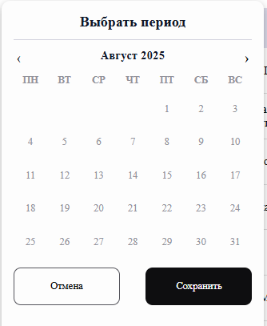
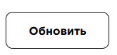
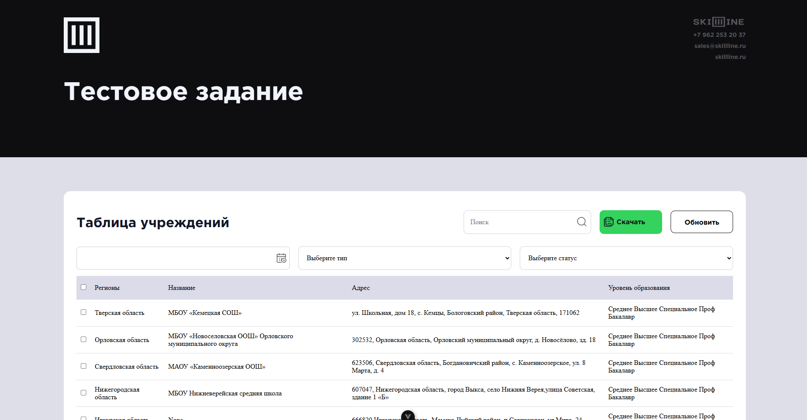
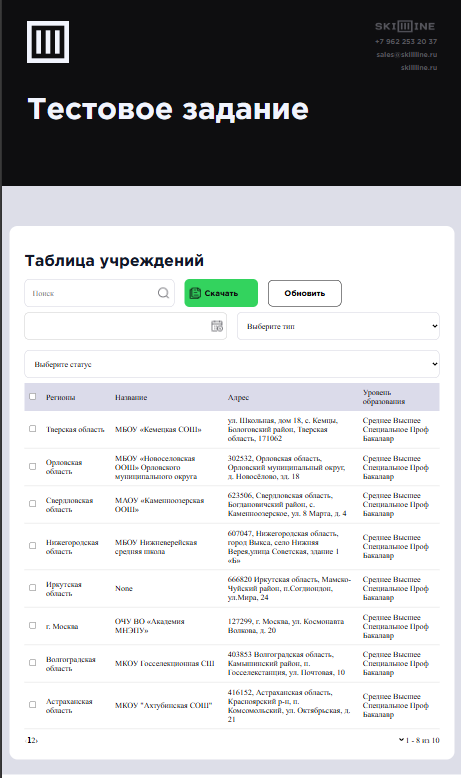
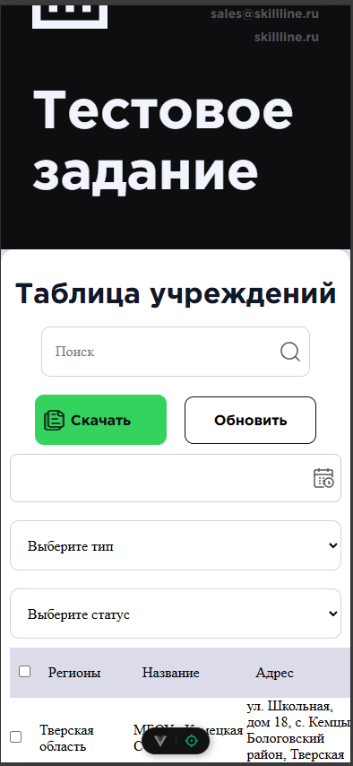

## Summary

Был добавлен компонент ( elements ):

`Из апдейтов бы сделал InstitutionTable.vue зависимым от пропсов таких как: апи и поля, что делается довольно незамысловато, но последние 3 дня у меня лихорадка. Внезапно.
`

`Время на тестовое и так превысило несколько дней из-за перехода с React, поэтому ui-kit оже в апдейтах
`

Ручками потыкал другие браузеры, проблем не было. 

## Адаптив

